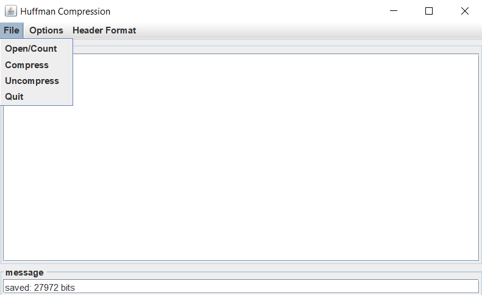

# Huffman Compression/Decompression



An implementation of the [**Huffman Coding**](https://en.wikipedia.org/wiki/Huffman_coding) algorithm using binary search trees. A GUI interface provided.

----

## Running the Program

To run the program, compile and run *Huff.java*.

```
    javac Huff.java
    java Huff
```

Once the program has started, the *compression* and *decompression* methods can be selected through the **File** menu. The methods will take a file input and perform the desired method.